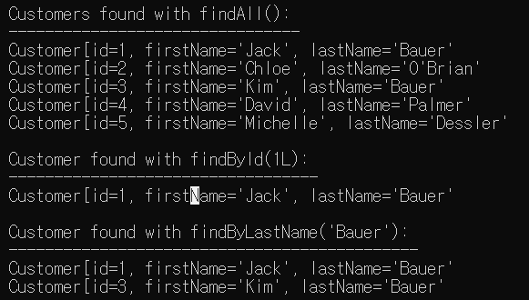

## Spring Data JPA 맛보기

본 내용은 Spring 공식 문서인 [Accessing Data with JPA](https://spring.io/guides/gs/accessing-data-jpa/)를 정리한 내용입니다.

## 다룰 내용

Spring Data JPA를 사용해서 관계형 데이터베이스에 데이터를 저장하고 조회합니다.

1. 실습 환경 점검
2. 프로젝트 생성
3. 엔티티 클래스 작성
4. 간단한 쿼리문 생성
5. 실행 코드 작성
6. 빌드

## 1. 실습 환경

- 텍스트 에디터 또는 IDE(Integrated Development Environment)
- JDK 1.8 또는 최신 버전
- Gradle 4 또는 Maven 3.2 이상

## 2. 프로젝트 생성

깃으로 프로젝트를 클론할 경우, 공식 문서를 참고해주세요.

1. [스프링 프로젝트 생성](https://start.spring.io/)
2. 프로젝트 설정
3. 의존성 라이브러리 설정: **Spring Data JPA**, **H2 Database**

## 3. 엔티티 클래스 작성

`Customer` 엔티티 클래스를 작성합니다. JPA는 자바 클래스를 기준으로 테이블을 생성하는데,

테이블에 매핑되는 클래스를 **엔티티(Entity)** 라고 합니다.

```
@Entity
public class Customer {

	@Id
	@GeneratedValue(strategy=GenerationType.AUTO)
	private Long id;
	private String firstName;
	private String lastName;

	protected Customer() {}

	public Customer(String firstName, String lastName) {
		this.firstName=firstName;
		this.lastName=lastName;
	}

	@Override
	public String toString() {
		return String.format(
				"Customer[id=%d, firstName='%d', lastName='%s'", id, firstName, lastName);
	}

	public Long getId() { return id; }
	public String getFirstName() { return firstName; }
	public String getLastName() { return lastName; }
}
```

`Customer` 테이블은 `id`, `firstName`, `lastName` 속성을 가집니다.

JPA 2.0 표준 스펙에 따른 protected 생성자와 Customer 생성자를 작성합니다.

1. **@Entity** : JPA 엔티티 클래스를 나타냅니다.
2. **@Id** : 엔티티 클래스의 id 속성을 나타냅니다.
3. **@GeneratedValue** : id 값이 자동으로 생성되도록 설정합니다.

## 4. 간단한 쿼리문 생성

Spring Data JPA는 런타임 환경에서 인터페이스만으로 구현 객체를 자동으로 생성해 주는 기능을 제공합니다.

```
public interface CustomerRepository extends CrudRepository<Customer, Long> {
	List<Customer> findByLastName(String lastName);
	Customer findById(long id);
}
```

**CustomerRepository**는 **CrudRepository**로부터 엔티티를 생성, 저장, 검색등 여러 메소드들을 상속받습니다.

이때 CrudRepository의 엔티티 타입 파라미터는 `Customer`, 아이디 타입 파라미터는 `Long`으로 지정하였습니다.

1. 첫 번째 메소드의 파라미터로 lastName이 입력되면, lastName을 가지는 Customer 리스트가 반환됩니다.

2. 두 번째 메소드의 파라미터로 id가 입력되면, id를 가지는 Customer 객체가 반환됩니다.

일반적으로 인터페이스를 정의했으면, 인터페이스를 구현하는 클래스를 작성해야 합니다.

하지만 Spring Data JPA를 사용하면 repository 인터페이스의 구현 객체를 생성할 필요가 없습니다.

## 5. 실행 코드 작성

```
@SpringBootApplication
public class AccessingDataWithJpaApplication {

	private static final Logger log = LoggerFactory.getLogger(AccessingDataWithJpaApplication.class);

	public static void main(String[] args) {
		SpringApplication.run(AccessingDataWithJpaApplication.class, args);
	}

	@Bean
	public CommandLineRunner demo(CustomerRepository repository) {
		return (args) -> {
			// 고객 정보 저장
			repository.save(new Customer("Jack", "Bauer"));
			repository.save(new Customer("Chloe", "0'Brian"));
			repository.save(new Customer("Kim", "Bauer"));
			repository.save(new Customer("David", "Palmer"));
			repository.save(new Customer("Michelle", "Dessler"));

			// 모든 고객 조회
			log.info("Customers found with findAll(): ");
			log.info("--------------------------------");
			for(Customer customer : repository.findAll()) {
				log.info(customer.toString());
			}
			log.info("");

			// ID로 단일 행의 고객 조회
			Customer customer = repository.findById(1L);
			log.info("Customer found with findById(1L): ");
			log.info("----------------------------------");
			log.info(customer.toString());
			log.info("");

			// LastName으로 복수 행의 고객 조회
			log.info("Customer found with findByLastName('Bauer'): ");
			log.info("---------------------------------------------");
			repository.findByLastName("Bauer").forEach(bauer -> {
				log.info(bauer.toString());
			});
			log.info("");
		};
	}

}
```

## 6. 빌드하기

**빌드(Build)** 는 프로젝트의 소스 파일들을 컴파일하고 JAR 파일을 생성하는 것을 의미합니다.

여기서는 **메이븐(Maven)** 이라는 빌드 도구로 프로젝트를 생성하였습니다.

**스프링 부트**는 웹 애플리케이션도 JAR 파일로 생성할 수 있도록 지원하기 때문에, java -jar 명령어로 웹 애플리케이션을

실행시켜서 결과를 바로 확인할 수 있습니다.

1. 프로젝트 폴더로 이동합니다.
2. `mvnw clean package` 명령어를 입력합니다.
3. `BUILD SUCCESS` 메시지가 뜬다면 성공적으로 JAR 파일이 생성된 것입니다.
4. 빌드 결과물들은 `target` 폴더에서 확인할 수 있습니다.
5. `java -jar accessing-data-with-jpa-0.0.1-SNAPSHOT.jar`명령어를 입력합니다.
6. 애플리케이션 실행 결과를 확인합니다.



## 결론

4번의 간단한 쿼리문 작성 부분에서 쿼리문을 작성한다고 했지만 Spring Data JPA를 통해 CrudRepository

인터페이스를 상속하므로써 쿼리문을 실행할 수 있었습니다. Spring Data JPA를 통해서 SQL을 개발자가 직접

다루지 않는 다는 점에서 유지보수성이 좋은 프레임워크로 생각됩니다. 또한 JPA에 대한 학습이 필요해 보입니다.

## Reference

- [JPA 2.0 Specification](https://stackoverflow.com/questions/6033905/create-the-perfect-jpa-entity)
- [Maven Download](https://maven.apache.org/download.cgi)
- [Maven Lifecycle](https://maven.apache.org/guides/introduction/introduction-to-the-lifecycle.html)
