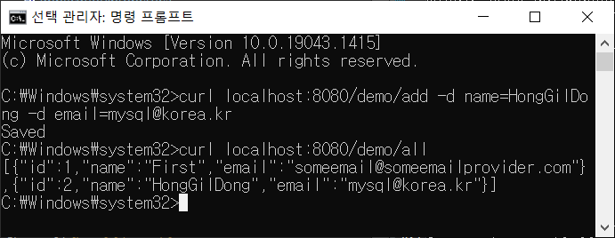

## Spring MySQL 연동 방법

본 내용은 Spring 공식 문서 [Accessing Data With MySQL](https://spring.io/guides/gs/accessing-data-mysql/)를 정리한 내용입니다.

내용을 읽기 전에 먼저 [JPA 맛보기](../Accessing_Data_with_JPA/Accessing_Data_with_JPA.md)를 읽고 직접 실습해 보는 것을 추천합니다.

## 다룰 내용

본 내용은 **Spring Data JPA**를 사용하여 MySQL 데이터베이스에 액세스하는 방법을 배웁니다. 데이터베이스를 생성하고, 애플리케이션을 빌드하고 데이터베이스에 연동합니다.

1. 실습 환경 점검
2. 프로젝트 생성
3. 데이터베이스 생성
4. 데이터베이스 설정
5. 엔티티 클래스 생성
6. 레포지토리 생성
7. 컨트롤러 생성
8. 애플리케이션 빌드
9. 애플리케이션 테스트
10. 데이터베이스 보안 설정

## 1. 실습 환경 점검

- MySQL 5.6 버전 (또는 그 이상)
- 텍스트 에디터 또는 IDE(Integrated Development Environment)
- JDK 1.8 또는 최신 버전
- Gradle 4 또는 Maven 3.2 이상

## 2. 프로젝트 생성

깃으로 프로젝트를 클론할 경우, 공식 문서를 참고해주세요.

1. [스프링 프로젝트 생성](https://start.spring.io/)
2. 프로젝트 설정
3. 의존성 라이브러리 설정: **Spring Web**, **Spring Data JPA**, **MySQL Driver**

Spring Data JPA 대신 Spring JDBC를 사용할 수도 있습니다.

## 3. 데이터베이스 생성

데이터베이스를 생성하기 전에 **MySQL**를 설치해야 합니다.

```
// MySQL 접속
mysql -u root -p

// 데이터베이스 생성
create database db_example;

// 사용자 생성
create user 'springuser'@'%' identified by 'The Password';

// 사용자에게 db_example의 모든 권한을 부여
grant all on db_example.* to 'springuser'@'%';

// 생성된 데이터베이스 확인
show databases;
```

## 4. 데이터베이스 설정

스프링 부트가 기본적으로 지원하는 H2 데이터베이스가 아닌 다른 데이터베이스를 사용하는 경우

`application.properties` 파일의 내용을 다음과 같이 작성해야 합니다.

### 4.1. application.properties 파일

이 파일은 애플리케이션이 실행될 때 읽어들이는 정보들을 포함합니다.

```
# JPA 설정
spring.jpa.hibernate.ddl-auto=update
spring.jpa.show-sql=true

# DataSource 설정
spring.datasource.url=jdbc:mysql://localhost:3306/db_example
spring.datasource.username=springuser // db_example 사용자 아이디
spring.datasource.password=ThePassword // db_example 사용자 비밀번호
spring.datasource.driver-class-name =com.mysql.cj.jdbc.Driver // 드라이버 클래스 로딩
```

`spring.datasource` 부분은 데이터 소스 설정으로 MySQL과 관련된 설정으로 이해하시면 됩니다.

`spring.jpa.hibernate.ddl-auto=update`: 엔티티 클래스가 변경될 때마다 자동으로 데이터베이스에 반영되도록 설정합니다.

`spring.jpa.show-sql=true`: JPA에서 생성한 SQL문을 보여주도록 설정합니다.

공식 문서의 `com.mysql.jdbc.Driver`로 지정하면 아래와 같은 경고 메시지가 나타납니다.

```
Loading class `com.mysql.jdbc.Driver`. This is deprecated. The new driver class is `com.mysql.cj.jdbc.Driver`.
The driver is automatically registered via the SPI and manual loading of the driver class is generally unnecessary.
```

## 5. 엔티티 클래스 작성

```
@Entity
public class User {
	@Id
	@GeneratedValue(strategy=GenerationType.AUTO)
	private Integer id;
	private String name;
	private String email;

	public Integer getId() {
		return id;
	}

	public void setId(Integer id) { this.id=id; }

	public String getName() { return name; }

	public void setName(String name) { this.name=name;	}

	public String getEmail() { return email; }

	public void setEmail(String email) { this.email=email; }
}
```

## 6. 레포지토리 생성

Spring Data JPA는 레포지토리 인터페이스를 구현하지 않고 CrudRepository 인터페이스를 상속합니다.

```
public interface UserRepository extends CrudRepository<User, Integer> {}
```

## 7. 컨트롤러 생성

HTTP 요청을 받는 MainController 클래스를 작성합니다.

```
@Controller
@RequestMapping(path="/demo")
public class MainController {
	@Autowired
	private UserRepository userRepository;

	@PostMapping(path="/add")
	public @ResponseBody String addNewUser(@RequestParam String name, @RequestParam String email) {
		User n = new User();
		n.setEmail(email);
		n.setName(name);
		userRepository.save(n);
		return "Saved";
	}

	@GetMapping(path="/all")
	public @ResponseBody Iterable<User> getAllUsers(){
		return userRepository.findAll();
	}
}
```

1. `@Controller` : 컨트롤러 클래스를 나타냅니다.
2. `@RequestMapping(path="/demo")` : "/demo"로 시작하는 URL 요청을 받습니다.
3. `@Autowired` : UserRepository 구현 객체를 할당 받습니다.
4. `@PostMapping("path="/add")` : URI가 `/add`인 POST 방식의 HTTP 요청시, 실행할 메소드를 지정합니다.
5. `@GetMapping(path="/all")` : URI가 `/all`인 GET 방식의 HTTP 요청시, 실행할 메소드를 지정합니다.
6. `@ResponseBody` : 응답 정보의 몸체(Body)의 반환 값을 포함시킵니다.
7. `@RequestParam` : HTTP 요청시 파라미터로 넘어온 값입니다.

## 8. 애플리케이션 빌드

1. 프로젝트 폴더로 이동합니다.
2. `mvnw clean package` 명령어를 입력합니다.
3. `BUILD SUCCESS` 메시지가 뜬다면 성공적으로 JAR 파일이 생성된 것입니다.
4. 빌드 결과물들은 `target` 폴더에서 확인할 수 있습니다.
5. `java -jar accessing-data-with-mysql-0.0.1-SNAPSHOT.jar`명령어를 입력합니다.
6. 애플리케이션 실행 결과를 확인합니다.

## 9. 애플리케이션 테스트

윈도우즈 프롬프트(CMD) 창을 열어서 curl 명령어로 애플리케이션이 잘 동작하는지 테스트합니다.

```
// 유저 추가
curl localhost:8080/demo/add -d name=First -d email=someemail@someemailprovider.com

// 모든 유저 목록 요청
curl localhost:8080/demo/all
```



## 10. 데이터베이스 보안 설정

애플리케이션을 외부에 노출시키기 전에 먼저 데이터베이스의 설정을 변경해야 합니다.

```
// 사용자에게 부여했던 권한을 모두 취소시킵니다.
mysql> revoke all on db_example.* from 'springuser'@'%';

// 애플리케이션이 데이터베이스를 사용할 수 있도록 최소한의 권한만 부여합니다.
mysql> grant select, insert, delete, update on db_example.* to 'springuser'@'%';

```
